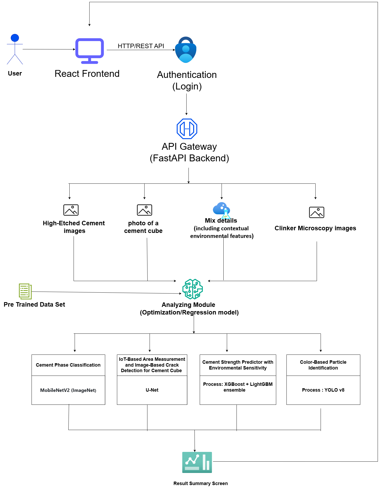

# INSEE Smart Cement Platform


## 🏗️ Project Overview

The **INSEE Smart Cement Platform** is an advanced AI-powered prediction and analysis system designed for cement quality control and research. This comprehensive platform integrates four cutting-edge machine learning components to revolutionize cement manufacturing processes through real-time monitoring, quality assessment, and predictive analytics.

### Key Features

- 🎯 **Multi-Output Strength Prediction**: Predict cement compressive strength at 1D, 2D, 7D, 28D, and 56D using ensemble ML models (XGBoost + LightGBM)
- 🔬 **Raw Meal Particle Analysis**: YOLOv9-based particle detection and color identification (dark red, light red, white) for quality control
- 🧱 **Crack Detection System**: Deep learning U-Net segmentation for structural integrity analysis
- 📊 **IoT Cube Monitoring**: Real-time environmental data tracking during cement curing process
- 🔐 **Secure Authentication**: JWT-based user authentication and session management
- 📈 **Historical Analytics**: Track predictions, generate reports, and analyze trends

---

## 🏛️ System Architecture



The platform follows a modular microservices architecture:

1. **Frontend Layer**: React-based user interface for seamless interaction
2. **Authentication Layer**: JWT-based secure login system
3. **API Gateway**: FastAPI backend routing requests to specialized modules
4. **Input Processing**: Multiple input types (images, data, environmental features)
5. **ML Analysis Module**: Pre-trained models with optimization/regression capabilities
6. **Four Specialized Components**:
   - Cement Phase Classification (MobileNetV2/ImageNet)
   - IoT-Based Measurement & Crack Detection (U-Net)
   - Cement Strength Predictor with Environmental Sensitivity (XGBoost + LightGBM)
   - Color-Based Particle Identification (YOLOv9)
7. **Result Summary**: Unified dashboard displaying all predictions and analyses

```

### Four Research Components

1. **Smart Cement Analyzer - AI-powered Cement Clinker Phase Classification**
   - Automated cement clinker phase classification
   - Deep learning model (MobileNetV2 + Transfer Learning)
   - Detailed confidence scores and phase information
   - Classes: C2S, C3A, C3S, C4AF

2. **Raw Meal Particle Analysis**
   - YOLOv9 machine learning model for detecting and counting cement raw meal particles
   - Microscopic image analysis and particle detection
   - Color-based particle identification: Dark red, light red, and white particles
   - Automated particle counting and distribution analysis

3. **IoT Cube Monitoring, Compressive Strength and Crack Detection**
   - U-Net deep learning segmentation
   - Structural integrity assessment
   - Crack severity analysis

4. **Early and Long-Term Cement Strength Prediction (Multi-Output)**
   - Predict strength at 5 time intervals (1D, 2D, 7D, 28D, 56D)
   - Ensemble learning (XGBoost + LightGBM)
   - 14 input parameters (physical + chemical composition)

---

## 🛠️ Technology Stack

### Frontend
- **Framework**: React 18
- **Styling**: TailwindCSS
- **Icons**: Lucide React
- **HTTP Client**: Axios
- **Build Tool**: Webpack (via react-scripts)

### Backend
- **Framework**: FastAPI
- **Server**: Uvicorn (ASGI)
- **Language**: Python 3.13
- **Validation**: Pydantic
- **Authentication**: JWT

### Machine Learning & AI
- **TensorFlow**: 2.20.0 (IoT monitoring, crack detection)
- **PyTorch**: 2.9.1 (YOLO models)
- **Ultralytics YOLOv9**: Latest (particle detection and counting)
- **XGBoost**: Latest (strength prediction)
- **LightGBM**: Latest (strength prediction)
- **Keras**: 3.13.0
- **Scikit-learn**: Latest

### Data Processing
- **NumPy**: 2.2.6
- **Pandas**: Latest
- **Polars**: 1.36.1
- **OpenCV**: 4.12.0
- **Pillow**: 12.0.0
- **Matplotlib**: 3.10.7

---

## 📋 Prerequisites

Before running the project, ensure you have the following installed:

- **Node.js**: v16.0.0 or higher
- **npm**: v8.0.0 or higher
- **Python**: 3.13 or higher
- **pip**: Latest version
- **Git**: For version control

---

## 📦 Dependencies

### Frontend Dependencies

```json
{
  "react": "^18.0.0",
  "react-dom": "^18.0.0",
  "react-router-dom": "^6.0.0",
  "axios": "^1.0.0",
  "lucide-react": "latest",
  "tailwindcss": "^3.0.0"
}
```

### Backend Dependencies

```txt
fastapi>=0.104.0
uvicorn[standard]>=0.24.0
pydantic>=2.0.0
python-multipart
tensorflow>=2.15.0
torch>=2.0.0
torchvision>=0.15.0
ultralytics>=8.0.0
opencv-python>=4.10.0
pillow>=10.3.0
numpy>=2.1.0
pandas>=2.0.0
polars>=0.20.0
scikit-learn>=1.3.0
xgboost>=2.0.0
lightgbm>=4.0.0
matplotlib>=3.7.0
scipy>=1.10.0
pyyaml>=6.0
psutil>=5.9.0
```

---

## 🚀 Installation & Setup

### 1. Clone the Repository

```bash
git clone https://github.com/VGSLakshan/Smart_cement_Y4.git
cd Smart_cement_Y4
```

### 2. Backend Setup

```bash
# Navigate to backend directory
cd backend

# Install Python dependencies
pip install -r requirements.txt

# Alternative: Install specific packages
pip install fastapi uvicorn tensorflow torch ultralytics opencv-python numpy pandas
```

### 3. Frontend Setup

```bash
# Navigate to frontend directory
cd frontend

# Install Node.js dependencies
npm install

# Install additional required packages
npm install lucide-react axios
```

---

## ▶️ Running the Project

### Start Backend Server

```bash
# From the backend directory
cd backend
python -m uvicorn app.main:app --reload --host 0.0.0.0 --port 8000
```

**Backend will be available at**: `http://localhost:8000`
**API Documentation**: `http://localhost:8000/docs`

### Start Frontend Development Server

```bash
# From the frontend directory (in a new terminal)
cd frontend
npm start
```

**Frontend will be available at**: `http://localhost:3000`

### Running Both Servers Simultaneously

**Terminal 1 - Backend:**
```bash
cd backend
python -m uvicorn app.main:app --reload --host 0.0.0.0 --port 8000
```

**Terminal 2 - Frontend:**
```bash
cd frontend
npm start
```

---

## 📁 Project Structure

```
Smart_cement_Y4/
├── backend/
│   ├── app/
│   │   ├── main.py                 # FastAPI application entry point
│   │   ├── routes/
│   │   │   ├── hirumi/            # Strength prediction endpoints
│   │   │   ├── kanchana/          # Raw meal analysis endpoints
│   │   │   └── sanchitha/         # Crack detection endpoints
│   │   └── services/              # Business logic and ML services
│   ├── ml_models/
│   │   ├── kanchana/
│   │   │   └── best.pt            # YOLO model (56MB)
│   │   └── sanchitha/
│   │       └── unet_seg_crack.h5  # U-Net model (23MB)
│   └── requirements.txt           # Python dependencies
│
├── frontend/
│   ├── public/
│   │   ├── index.html
│   │   └── insee-logo.png
│   ├── src/
│   │   ├── App.js                 # Main application component
│   │   ├── components/
│   │   │   ├── Navbar.js          # Top navigation bar
│   │   │   ├── Sidebar.js         # Left sidebar navigation
│   │   │   └── ResearchCard.js    # Component cards
│   │   └── pages/
│   │       ├── Home.js            # Dashboard
│   │       ├── Login.js           # Authentication
│   │       ├── CementStrengthDetail.js        # Component 4
│   │       ├── CompressiveStrengthDetail.js   # Component 3
│   │       └── RawMealPages.js               # Component 2
│   ├── package.json
│   └── tailwind.config.js
│
└── README.md
```

---

## 🔧 Configuration

### Backend Configuration

Edit `backend/app/main.py` for CORS settings:

```python
app.add_middleware(
    CORSMiddleware,
    allow_origins=["http://localhost:3000"],
    allow_credentials=True,
    allow_methods=["*"],
    allow_headers=["*"],
)
```

### Frontend API Configuration

Update API endpoint in frontend components if needed:

```javascript
const response = await fetch('http://localhost:8000/api/hirumi/predict', {
    method: 'POST',
    headers: { 'Content-Type': 'application/json' },
    body: JSON.stringify(data)
});
```

---

## 📊 API Endpoints

### Authentication
- `POST /api/auth/login` - User login
- `POST /api/auth/logout` - User logout

---

## 👥 Contributors

- **Chamudini** - cement clinker phase classification system(Component 1)
- **Kanchana** - Raw Meal Particle Analysis (Component 2)
- **Sanchitha** - IoT Cube Monitoring & Crack Detection System (Component 3)
- **Hirumi** - Cement Strength Prediction (Component 4)

---

## 📄 License

This project is developed for **INSEE Cement - AI Research Lab**.  
© 2025 INSEE. All rights reserved.

---

## 🔗 Related Links

- **FastAPI Documentation**: https://fastapi.tiangolo.com/
- **React Documentation**: https://react.dev/
- **TensorFlow**: https://www.tensorflow.org/
- **Ultralytics YOLO**: https://docs.ultralytics.com/

---

## 📧 Support

For questions or issues, please contact the INSEE AI Research Lab team.

**Built with ❤️ for Innovation in Cement Manufacturing**
